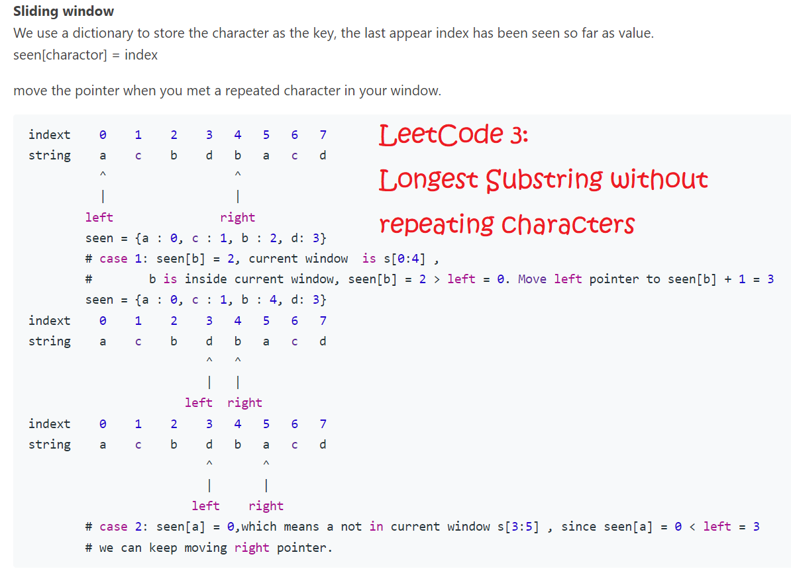

# LeetCode-Notes
Here I will record all the useful information that I learned or gained from praticing LeetCode problems

Note: :heavy_check_mark: means **very important, typical, or good examples** that should definitely be familiar with

## Functions and Methods

---
### Dynamic Programming

```
# To generate a 2D array of dimension m * n:
dp = [[0]*n for i in range(m)]
```

[70. Climbing Stairs](https://leetcode.com/problems/climbing-stairs/): dynamic programming to find number of ways to climb to a stair

[139. Word Break](https://leetcode.com/problems/word-break/): check if word can be broken down to elements in a word dictionary

:heavy_check_mark: [22. Generate Parentheses](https://leetcode.com/problems/generate-parentheses/): generate all combinations of well-formed parentheses from given number of pairs

[62. Unique Paths](https://leetcode.com/problems/unique-paths/): all unique paths from top-left corner of a grid to bottom-right

[64. Minimum Path Sum](https://leetcode.com/problems/minimum-path-sum/): minimum path from top-left corner of a grid to bottom-right

---

### Kadane's Algorithm (Maximum Subarray)
```
# The thought follows a simple rule:
# If the sum of a subarray is positive, it has possible to make the next value bigger, so we keep do it until it turn to negative.
# If the sum is negative, it has no use to the next element, so we break.
# it is a game of sum, not the elements.

Initialize:
    max_so_far = INT_MIN
    max_ending_here = 0

Loop for each element of the array
  (a) max_ending_here = max_ending_here + a[i]
  (b) if(max_so_far < max_ending_here)
            max_so_far = max_ending_here
  (c) if(max_ending_here < 0)
            max_ending_here = 0
return max_so_far
```

:heavy_check_mark: [53. Maximum Subarray](https://leetcode.com/problems/maximum-subarray/): find subarray whose sum is maximized

---
### Bit Operations (Including Kernighan's Algorithm - which is a DP algorithm)
About Python **Bitwise Operators**: [link](https://wiki.python.org/moin/BitwiseOperators) (<<, >>, &, |, ~, and ^)

About **Kernighan's Algorithm**: [link](https://iq.opengenus.org/brian-kernighan-algorithm/)

```
def Kenighan_algo(n):
    cnt = 0
    while n != 0 :
        cnt += 1 # Each iteration will count one 1 digit in n
        n = n & n-1 # unsets the right most set bit
           
    return cnt

# Patterns:
# i= 1 ( 1 &  0 =  0)     1 &     0 =     0  n_ones =  1
# i= 2 ( 2 &  1 =  0)    10 &     1 =     0  n_ones =  1
# i= 3 ( 3 &  2 =  2)    11 &    10 =    10  n_ones =  2
# i= 4 ( 4 &  3 =  0)   100 &    11 =     0  n_ones =  1
# i= 5 ( 5 &  4 =  4)   101 &   100 =   100  n_ones =  2
# i= 6 ( 6 &  5 =  4)   110 &   101 =   100  n_ones =  2
# i= 7 ( 7 &  6 =  6)   111 &   110 =   110  n_ones =  3
# i= 8 ( 8 &  7 =  0)  1000 &   111 =     0  n_ones =  1
# i= 9 ( 9 &  8 =  8)  1001 &  1000 =  1000  n_ones =  2
# i=10 (10 &  9 =  8)  1010 &  1001 =  1000  n_ones =  2
```

[191. Number of 1 Bits](https://leetcode.com/problems/number-of-1-bits/): count number of 1 in a bit string

:heavy_check_mark: [338. Counting Bits](https://leetcode.com/problems/counting-bits/): count number of 1 for binary representation of integers up to a limit (dynamic programming)

---
### Rotate Matrix
**General Idea**: [link](https://leetcode.com/problems/rotate-image/discuss/18872/A-common-method-to-rotate-the-image)

```
/*
 * clockwise rotate
 * first reverse up to down, then swap the symmetry (transpose)
 * 1 2 3     7 8 9     7 4 1
 * 4 5 6  => 4 5 6  => 8 5 2
 * 7 8 9     1 2 3     9 6 3
*/

/*
 * anticlockwise rotate
 * first reverse left to right, then swap the symmetry
 * 1 2 3     3 2 1     3 6 9
 * 4 5 6  => 6 5 4  => 2 5 8
 * 7 8 9     9 8 7     1 4 7
*/
```

:heavy_check_mark: [48. Rotate Image](https://leetcode.com/problems/rotate-image/): rotate a matrix clockwise

---

### Sliding Window (Usually Related to Substrings)


:heavy_check_mark: [3. Longest Substring Without Repeating Characters](https://leetcode.com/problems/longest-substring-without-repeating-characters/): (using dictionary for seen\[character\] = index)

---
### List Sorting and Partitioning

**Dutch National Flag Problem**: [link](https://en.wikipedia.org/wiki/Dutch_national_flag_problem)
```
procedure three-way-partition(A : array of values, mid : value):
    i ← 0
    j ← 0
    k ← size of A - 1

    while j <= k:
        if A[j] < mid:
            swap A[i] and A[j]
            i ← i + 1
            j ← j + 1
        else if A[j] > mid:
            swap A[j] and A[k]
            k ← k - 1
        else:
            j ← j + 1
```


:heavy_check_mark: [75. Sort Colors](https://leetcode.com/problems/sort-colors/): sort list of elements 0, 1, 2 in ascending order (**Dutch National Flag Problem**)

---
## Data Structures

---
### Dictionary
[136. Single Number](https://leetcode.com/problems/single-number/): find the number in array that only appeared once (enumerating dict.items())

[17. Letter Combinations of a Phone Number](https://leetcode.com/problems/letter-combinations-of-a-phone-number/): letter combinations that the numbers can form （mapping digits to corresponding letters）


---
### Stack
[155. Min Stack](https://leetcode.com/problems/min-stack/): design a stack that supports push, pop, top, and getMin


---
### [Collections.defaultdict](https://docs.python.org/3/library/collections.html#collections.defaultdict)

:heavy_check_mark: [494. Target Sum](https://leetcode.com/problems/target-sum/submissions/): combinations of '+' and '-' to build expression up to target sum (KEY = sum; VAL = number of ways to form this sum)

[49. Group Anagrams](https://leetcode.com/problems/group-anagrams/): group anagrams that are made of same set of letters (KEY = tuple of hashed 26 letters; VAL = list of anagrams with KEY combination of letters)

---
### [Collections.Counter](https://docs.python.org/3/library/collections.html#collections.Counter)

```
# Initialization
cnt = Counter()
    ... # Code to populate the counter (e.g., cnt[key] += value)
    ... # Or to create counter directly from list (e.g., cnt = Counter(list))

# Counter.items():
for key, val in counter.items():
    ... # key is the element, val is its count

# Counter.most_common(k):
for key, val in cnt.most_common(k):
    ... # key is the element, val is its count

```


[169. Majority Element](https://leetcode.com/problems/majority-element/): find the mode of a list (using **Counter.items()**)

[347. Top K Frequent Elements](https://leetcode.com/problems/top-k-frequent-elements/): (using **Counter.most_common(k)**)

---
