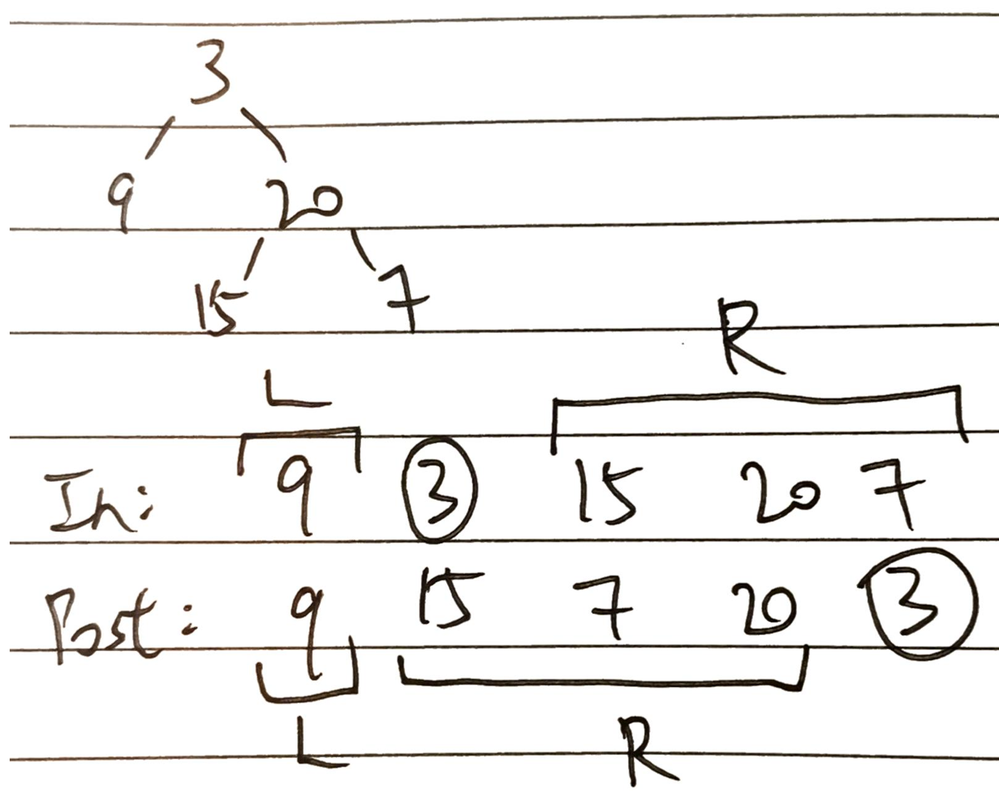
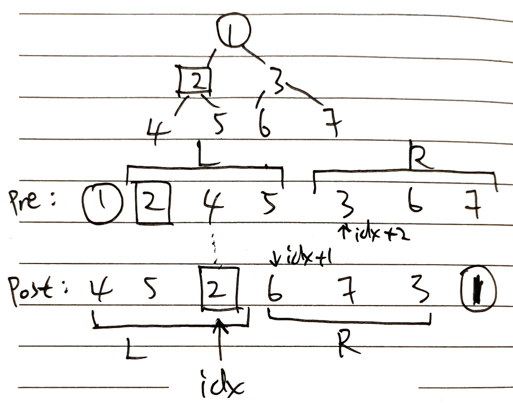

# Binary Trees & Binary Search Trees
* **Note**: 
  * :heavy_check_mark: means **MUST DO (i.e., very important, typical, or good) problems** that should definitely be familiar with
  * :wavy_dash: means problems that are less typical
  * :green_book: means **EASY problems** as defined by LeetCode
  * :orange_book: means **MEDIUM problems** as defined by LeetCode
  * :closed_book: means **HARD problems** as defined by LeetCode

- **LeetCode Problems**: [List](https://leetcode.com/tag/binary-tree/)

- **Reference 1**: [Study Guide - LeetCode Problems](https://leetcode.com/tag/binary-tree/discuss/1212004/Binary-Trees-study-guide)

- **Reference 2**: [Study Guide - Concepts](https://leetcode.com/tag/binary-tree/discuss/1820334/Become-Master-in-Tree)

## - Binary Tree Traversals and Operations (Usually with Recursion)
- About **Binary Tree Traversals Algorithms**:


```
def preorder(root):
  return [root.val] + preorder(root.left) + preorder(root.right) if root else []
  
#######################################  

def inorder(root):
  return  inorder(root.left) + [root.val] + inorder(root.right) if root else []
  
#######################################  

def postorder(root):
  return  postorder(root.left) + postorder(root.right) + [root.val] if root else []
  
#######################################  

def levelorder(root): # AKA: BFS
  if not root:
      return None

  result = []
  queue = [root]

  while queue: # each iteration is a level

      level = [] # the value of each node in this level

      for i in range(len(queue)): # for each node in queue

          node = queue.pop(0)
          level.append(node.val)
          if node.left:  queue.append(node.left)
          if node.right: queue.append(node.right)

      result.append(level) # save the values on this level

  return result
```
- About **Top-down** and **Bottom-up** recursions: [link](https://leetcode.com/explore/learn/card/data-structure-tree/17/solve-problems-recursively/534/)

```
def maxDepth_bottomUp(root):
    
    # stop conditions    
    if not root:
        return 0
    
    left_depth, right_depth = 0, 0
    
    # assuming maxDepth works perfectly
    if root.left is not None:
        left_depth = maxDepth_bottomUp(root.left)
        
    if root.right is not None:
        right_depth = maxDepth_bottomUp(root.right)
    
    # go up one layer (+ 1 account for going up one layer)
    return 1 + max(left_depth, right_depth)

###############################################################

def maxDepth_topDown(root, current_level, max_level):
    # stop conditions    
    if not root:
        return 0
    
    if current_level > max_level[0]:
        max_level[0] = current_level
        
    maxDepth_topDown(root.left, current_level + 1, max_level)
    maxDepth_topDown(root.right, current_level + 1, max_level)
```

---

## - Binary Search Trees (BSTs)
- **In-order Traversal**
```
result = []

def inorder(node):
    if node:
        inorder(node.left)
        # do something to your node here
        if node.val >= low and node.val <= high:
            result.append(node.val)
        inorder(node.right)
    
# result will have node values ordered in ascending order
```
- **Deleting a Node from BST**
```
def deleteNode(self, root, key):
    
    # Reference Solution:
    # https://leetcode.com/problems/delete-node-in-a-bst/discuss/821420/Python-O(h)-solution-explained
    
    if not root:
        return None

    if root.val == key:
        if not root.right: return root.left
        if not root.left: return root.right
            
        if root.left and root.right:
                
            # go right one step and go to the left most node, replace current node value with that
            temp = root.right
            while temp.left: temp = temp.left
                    
            root.val = temp.val
            root.right = self.deleteNode(root.right, root.val) # delete the replaced value from right tree
                
    elif root.val > key:
        root.left = self.deleteNode(root.left, key)
    else:
        root.right = self.deleteNode(root.right, key)
            
    return root

```
- **Inserting a Node to BST**

```
def insertIntoBST(self, root, val):
        """
        :type root: TreeNode
        :type val: int
        :rtype: TreeNode
        """
        
        # Reference Solution:
        # https://leetcode.com/problems/insert-into-a-binary-search-tree/discuss/180244/Python-4-line-clean-recursive-solution
        
        if not root:
            return TreeNode(val)
        
        if root.val < val:
            root.right = self.insertIntoBST(root.right, val)
        else:
            root.left = self.insertIntoBST(root.left, val)
            
        return root
```

---
### - Path Problems on BSTs

- **A DFS path search on BSTs**: (see LeetCode 257)
```
# root-to-leaf path traversal (DFS)
def dfs(self, node, path, result):
    if not node.left and not node.right: # we have arrived at a leaf node
        result.append(path + str(node.val))
        return
            
    if node.left:
        self.dfs(node.left, path + str(node.val) + '->', result)
    if node.right:
        self.dfs(node.right, path + str(node.val) + '->', result)
```


---
### - Construct Binary Trees

- **In-order + Pre-order**: (see LeetCode 105)


```
if len(inorder) == 0:
    return None

if len(inorder) == 1: # only one element, construct a node for it
    return TreeNode(preorder[0])

rval = preorder[0] # Obtain nodes from preorder - from LEFT to RIGHT
root = TreeNode(rval)

# Looking at preorder traversal, the first value (node 1) must be the root.
# Then, we find the index of root within in-order traversal, and split into two sub problems.
inorder_rval_index = inorder.index(rval)

left_inorder = inorder[:inorder_rval_index]
right_inorder = inorder[inorder_rval_index+1:]
left_preorder = preorder[1: len(left_inorder) + 1]
right_preorder = preorder[1 + len(left_preorder):]

root.left = self.buildTree(left_preorder, left_inorder)
root.right = self.buildTree(right_preorder, right_inorder)

return root
```

- **In-order + Post-order**: (see LeetCode 106)


```
if len(inorder) == 0:
        return None
if len(inorder) == 1:
    return TreeNode(inorder[0])

rval = postorder[-1] # Obtain nodes from preorder - from RIGHT to LEFT
root = TreeNode(rval)

inorder_rval_index = inorder.index(rval)

left_inorder = inorder[:inorder_rval_index]
right_inorder = inorder[inorder_rval_index+1:]
left_postorder = postorder[:len(left_inorder)]
right_postorder = postorder[len(left_postorder):-1]

root.left = self.buildTree(left_inorder, left_postorder)
root.right = self.buildTree(right_inorder, right_postorder)

return root
```

- **Pre-order + Post-order**: (see LeetCode 889)



```
if len(preorder) == 0:
    return None
if len(preorder) == 1:
    return TreeNode(preorder[0])

rval = preorder[0]
root = TreeNode(rval)

val = preorder[1]
postorder_idx = postorder.index(val)

left_preorder = preorder[1:postorder_idx + 2]
right_preorder = preorder[postorder_idx + 2:]

left_postorder = postorder[: postorder_idx + 1]
right_postorder = postorder[postorder_idx + 1:-1]

root.left = self.constructFromPrePost(left_preorder, left_postorder)
root.right = self.constructFromPrePost(right_preorder, right_postorder)

return root
```


---
### - Validate Binary Trees

- **Validate Binary Tree**: (see LeetCode 98)

```
# Floor: all values must be larger than this
# Ceiling: all values must be smaller than this
def isValidBST(self, root, floor=float('-inf'), ceiling=float('inf')):
    """
    :type root: TreeNode
    :rtype: bool
    """

    if not root: # no node is a valid BST
        return True

    if root.val <= floor or root.val >= ceiling:
        return False

    # in the left branch, root is the new ceiling; contrarily root is the new floor in right branch
    return self.isValidBST(root.left, floor, root.val) and self.isValidBST(root.right, root.val, ceiling)
```


---
### - Lowest Common Ancestor (LCA) Problems

- **LCA of a Binary Tree**: [YouTube Tutorial](https://www.youtube.com/watch?v=py3R23aAPCA)

```
def lowestCommonAncestor(self, root, p, q):
        """
        :type root: TreeNode
        :type p: TreeNode
        :type q: TreeNode
        :rtype: TreeNode
        """

    if not root: return None
    if root == p or root == q: # looking for myself
        return root

    left_LA = self.lowestCommonAncestor(root.left, p, q)
    right_LA = self.lowestCommonAncestor(root.right, p, q)

    if left_LA and right_LA:
            return root
    if left_LA and not right_LA:
        return left_LA
    if right_LA and not left_LA:
        return right_LA
```


---
### - Miscellaneous Problems

- **Flatten BST to sort of a "linked list"**: (see LeetCode 114)


```
if not root:
    return None

curr = root

while curr:
    if curr.left:
        p = curr.left
        while p.right:
            p = p.right # p is right-most point in left subtree

        p.right = curr.right
        curr.right = curr.left
        curr.left = None
    curr = curr.right      
```

- **Find Positions of Nodes in BST with BFS + Queue**: (see LeetCode 662 & 993)
  - Root at depth 0, all positions start from 0; go left, position * 2; go right, position * 2 + 1
  - Output tuple: (node value, node depth, node position in that level)
```
positions = []
queue = [(root, 0, 0)]
cur_depth = left = ans = 0
for node, depth, pos in queue:

    if node:
        queue.append((node.left, depth+1, pos*2))
        queue.append((node.right, depth+1, pos*2 + 1))

for node, depth, pos in queue:
    if node:
        positions.append((node.val, depth, pos))
    else:
        positions.append(("null", depth, pos))

print(positions) # Format: (node value, node depth, node position in that level)
```

---
